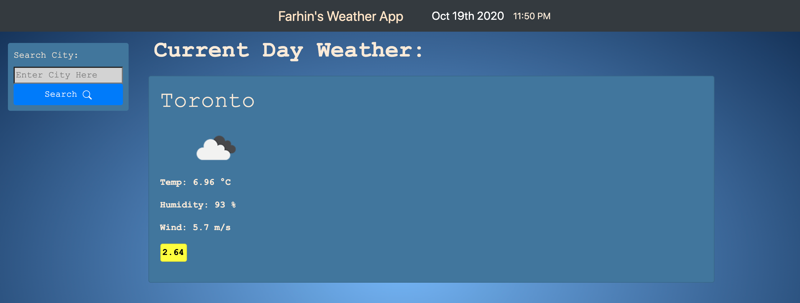
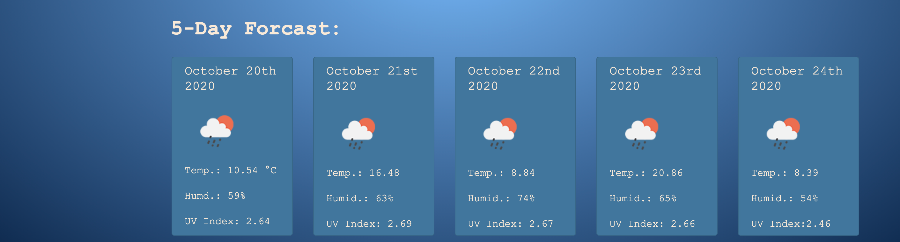

# Homework6_WeatherApp
by: Farhin Chowdhury

https://farhinchowdhury.github.io/Homework6_Weather/

## Description:

 Create a webpage that will showcase the weather of any city being searched for the current day and for 5 concequtive days after. All the weather information that were used were acquired from OpenWeather APIs. 

## Technologies Used:
    - Languages: HTML, CSS Bootstrap, JavaScript, Jquery.
    - Moment.js
    - API calls from Open Weather API
    

## Questions:

If you have any questions about the repo, open an issue or contact me directly at farhinchowdhury0@gmail.com. You can find more of my work at [FarthinChowdhury](https://github.com/FarthinChowdhury).